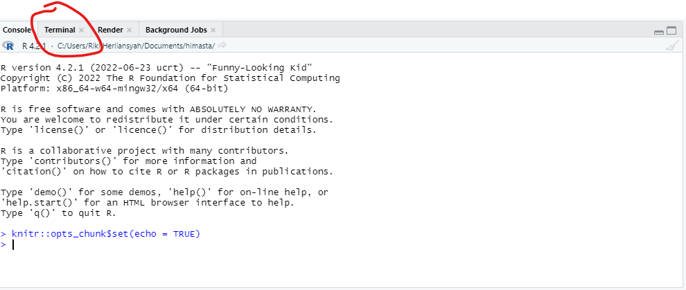
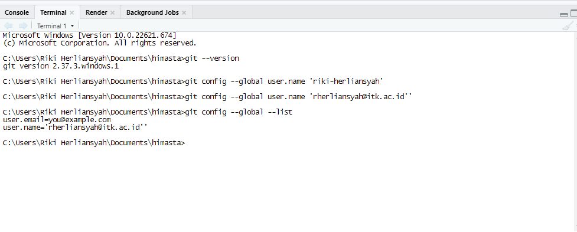

Prior to Workshop
================
Riki Herliansyah,
12/11/2022

## Instalasi R dan RStudio

1.  Langkah pertama yang harus dilakukan bagi para peserta adalah
    memastikan dua perangkat ini sudah terinstall di laptop
    masing-masing. Untuk menginstall R, silahkan ikuti link berikut
    [ini](https://cran.r-project.org/bin/windows/base/), dan klik
    *Download R-4.2.2 for Windows*.

2.  Setelah R terinstal, langkah selanjutnya adalah melakukan instalasi
    RStudio. RStudio merupakan salah satu alternatif interface yang
    digunakan untuk mengedit coding. RStudio memiliki 4 jendela utama
    yaitu R editor (R Console), jendela R Script, jendela grafik dan
    informasi lain seperti packages serta yang terakhir jendela
    environment. Silahkan download RStudio
    [disini](https://posit.co/download/rstudio-desktop/).

3.  Setelah kedua perangkat terinstall, kita akan membutuhkan package
    rmarkdown untuk membuat dokumen baik itu dokumen presentasi, MS word
    atau html. Buka RStudio yang telah diisntal, kemudian pada R Console
    ketikkan perintah berikut:

``` r
install.packages("rmarkdown")
```

4.  Terakhir, peserta juga diharapkan menginstal *pandoc* yang merupakan
    perangkat yang digunakan oleh rmarkdown untuk mengkonversi dokumen
    ke berbagai format. Klik link berikut ini [download
    pandoc](https://pandoc.org/installing.html) dan instal aplikasi
    tersebut.

## Setting GitHub account

Setelah selesai dengan semua perangkat tersebut, selanjutnya adalah
pengaturan *GitHub*.

1.  Langkah pertama, peserta harus membuat akun GitHub terlebih dahulu.
    Silahkan membuat akun pada link berikut [Sign
    Up](https://github.com/). Gunakan email pribadi dan jika akun ini
    akan digunakan seterusnya, gunakanlah email utama dan nama yang
    baik.

2.  Untuk bisa menggunakan GitHub, peserta juga harus melakukan
    instalasi perangkat *Git*. Jika pengguna Windows, silahkan ikut
    langkah berikut untuk menginstal Git
    [disini](https://git-scm.com/download/win). Kemudian, pilih *Click
    here to download*. Pada saat proses instalasi, centang opsi default
    pada setiap pengaturan yang muncul.

3.  Untuk pengguna Linux atau Mac, instalasi Git agak sedikit sulit
    karena harus ada beberapa set-up yang dilakukan. Karena terbatasnya
    waktu, jadi untuk pengguna Mac atau Linux bisa bergabung dengan
    peserta lain yang menggunakan Windows atau sekedar mengikut
    pelatihan tanpa praktek.

4.  Setelah Git terinstal, kita hampir selesai dengan persiapan untuk
    workshop. Untuk mengaktifasi dan menghubungkan Git ke akun Github,
    akan kita lakukan pada saat workshop.

## Connected Git to GitHub account

Langkah ini, saya sengaja tulis untuk peserta mencoba terlebih dahulu
sebelum workshop. Jika berhasil, maka selamat GitHub anda siap untuk
digunakan. Jika belum, jangan berkecil hati kita akan melakukan langkah
ini di awal Workshop.

1.  Di sebelah jendela R Console, terdapat jendela **Terminal**, klik
    jendela tersebut.

<!-- -->

2.  Kemudian ketikkan perintah berikut **git –version** (dua buah -)
    untuk memeriksa apakah Git sudah terinstal pada laptop kita. Jika
    Git telah terinstal dengan baik, maka setelah kita menekan tombol
    Enter, akan muncul versi Git yang telah terinstal.

3.  Selanjutnya, ketikkan perintah berikut satu per satu di jendela
    terminal.

``` r
git config --global user.name 'usernama GitHub anda'
git config --global user.email 'Email GitHub'
git config --global --list
```

4.  Jika tidak ada kendala, maka hasilnya akan muncul seperti ini.

<!-- -->
